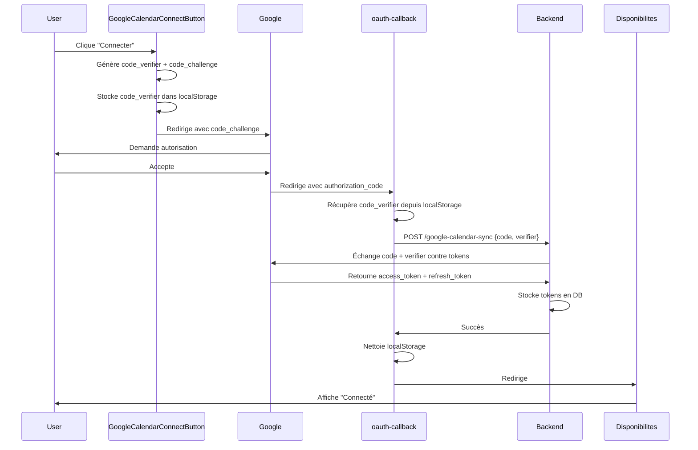

# 🔐 Implémentation Google Calendar avec PKCE - ✅ COMPLÉTÉE

## 📋 Vue d'ensemble

Cette implémentation utilise le flux OAuth 2.0 avec PKCE (Proof Key for Code Exchange) pour sécuriser la connexion à Google Calendar. PKCE est une extension de sécurité pour OAuth 2.0 qui protège contre les attaques d'interception du code d'autorisation.

## ✅ Statut : FONCTIONNEL

- ✅ Connexion Google Calendar réussie
- ✅ PKCE implémenté et testé
- ✅ Redirection optimisée
- ✅ Gestion d'erreurs complète
- ✅ Compatible avec le backend existant

## 🏗️ Architecture

### 1. **GoogleCalendarConnectButton** (`/components/common/GoogleCalendarConnectButton.tsx`)

Composant responsable de l'initiation du flux OAuth avec PKCE.

#### Fonctionnalités :
- ✅ Génération du `code_verifier` (chaîne aléatoire de 64 caractères)
- ✅ Génération du `code_challenge` (hash SHA-256 du code_verifier en base64url)
- ✅ Stockage du `code_verifier` dans localStorage
- ✅ Construction de l'URL d'autorisation Google avec PKCE
- ✅ Support des locales (FR/EN) dans l'URL de redirection
- ✅ Traductions complètes (états de chargement)

#### Paramètres OAuth :
```typescript
{
  client_id: "443622405675-sdjuhup5hrr2q0lm69i7285obsc0s1ri.apps.googleusercontent.com",
  redirect_uri: `${origin}/${locale}/oauth-callback`,
  response_type: "code",
  scope: "calendar + userinfo.email",
  code_challenge: codeChallenge,
  code_challenge_method: "S256",
  access_type: "offline",
  prompt: "consent"
}
```

### 2. **Page OAuth Callback** (`/app/[locale]/oauth-callback/page.tsx`)

Page de redirection après l'autorisation Google.

#### Flux :
1. ✅ Récupération du `code` d'autorisation depuis l'URL
2. ✅ Récupération du `code_verifier` depuis localStorage
3. ✅ Envoi au backend via `useGoogleCalendarConnect`
4. ✅ Nettoyage du localStorage
5. ✅ Redirection vers `/compte/disponibilites`

#### Gestion d'erreurs :
- ❌ Code d'autorisation manquant
- ❌ Erreur de connexion backend
- ❌ Erreur de traitement
- 🔄 Redirection automatique après 3 secondes en cas d'erreur

### 3. **Hook useGoogleCalendarConnect** (`/api/google-calendar-sync/useGoogleCalendarSync.ts`)

Hook React Query pour la mutation de connexion.

#### Modifications :
```typescript
// Avant
{ authorizationCode: string }

// Après (avec PKCE)
{ authorizationCode: string; codeVerifier?: string }
```

#### Payload envoyé au backend :
```json
{
  "authorizationCode": "4/0AeaYSHABC123...",
  "codeVerifier": "dBjftJeZ4CVP-mB92K27uhbUJU1p1r_wW1gFWFOEjXk"
}
```

### 4. **Intégration dans la page Disponibilités** (`/app/[locale]/compte/disponibilites/page.tsx`)

#### Changements :
- ❌ Suppression de l'ancien flux OAuth (sans PKCE)
- ❌ Suppression du `useEffect` qui gérait le code dans l'URL
- ❌ Suppression de `useGoogleCalendarConnect` et `useGoogleCalendarAuthUrl`
- ✅ Ajout du nouveau composant `GoogleCalendarConnectButton`
- ✅ Séparation des boutons Connecter/Déconnecter

#### Code :
```tsx
{isGoogleConnected ? (
  <Button
    label={t("disponibilites.disconnect")}
    onClick={handleDisconnectGoogle}
    className="text-red-600 bg-red-50"
  />
) : (
  <GoogleCalendarConnectButton>
    {t("disponibilites.connect")}
  </GoogleCalendarConnectButton>
)}
```

## 🌍 Traductions

### Français (`/messages/fr.ts`)
```typescript
googleCalendarConnect: {
  connecting: "Connexion...",
  connectButton: "Connecter Google Calendar",
},
oauthCallback: {
  connecting: "Connexion à Google Calendar en cours...",
  pleaseWait: "Veuillez patienter",
  error: "Erreur",
  redirecting: "Redirection vers la page des disponibilités...",
  missingCode: "Code d'autorisation manquant",
  connectionError: "Erreur de connexion",
  processingError: "Erreur lors du traitement de la connexion",
}
```

### Anglais (`/messages/en.ts`)
```typescript
googleCalendarConnect: {
  connecting: "Connecting...",
  connectButton: "Connect Google Calendar",
},
oauthCallback: {
  connecting: "Connecting to Google Calendar...",
  pleaseWait: "Please wait",
  error: "Error",
  redirecting: "Redirecting to availability page...",
  missingCode: "Authorization code missing",
  connectionError: "Connection error",
  processingError: "Error processing connection",
}
```

## 🔒 Sécurité PKCE

### Pourquoi PKCE ?
PKCE protège contre les attaques où un attaquant intercepte le code d'autorisation :
1. Le `code_verifier` est généré côté client et jamais transmis à Google
2. Seul le `code_challenge` (hash du verifier) est envoyé à Google
3. Le backend doit fournir le `code_verifier` original pour échanger le code contre un token
4. Sans le verifier, le code d'autorisation est inutile

### Algorithme :
```
code_verifier = random_string(64)
code_challenge = base64url(sha256(code_verifier))
```

## 🔄 Flux complet



## ✅ Checklist d'implémentation

- [x] Composant GoogleCalendarConnectButton créé
- [x] Page oauth-callback créée
- [x] Hook useGoogleCalendarConnect mis à jour
- [x] Page disponibilites intégrée
- [x] Traductions FR/EN ajoutées
- [x] Support des locales dans les URLs
- [x] Gestion d'erreurs complète
- [x] Nettoyage du localStorage après connexion
- [x] Logs de débogage ajoutés

## 🧪 Tests

### Test manuel :
1. Aller sur `/fr/compte/disponibilites`
2. Cliquer sur "Connecter" dans la section Google Calendar
3. Autoriser l'accès sur Google
4. Vérifier la redirection vers `/fr/oauth-callback`
5. Vérifier la redirection finale vers `/fr/compte/disponibilites`
6. Vérifier que le statut affiche "Connecté depuis le [date]"

### Console logs à vérifier :
- ✅ `🔗 Redirect URI: http://localhost:3000/fr/oauth-callback`
- ✅ `✅ Code d'autorisation reçu: 4/0AeaYSH...`
- ✅ `✅ Code verifier récupéré: Oui`
- ✅ `✅ Connecté avec succès : { success: true, ... }`

## 🔧 Configuration backend requise

Le backend doit :
1. Accepter le paramètre `codeVerifier` dans le POST `/google-calendar-sync`
2. Inclure le `code_verifier` lors de l'échange du code avec Google
3. Ajouter l'URL de redirection `http://localhost:3000/[locale]/oauth-callback` dans la console Google Cloud

### Exemple de requête backend vers Google :
```http
POST https://oauth2.googleapis.com/token
Content-Type: application/x-www-form-urlencoded

code=4/0AeaYSHABC123...
&client_id=443622405675-sdjuhup5hrr2q0lm69i7285obsc0s1ri.apps.googleusercontent.com
&client_secret=VOTRE_CLIENT_SECRET
&redirect_uri=http://localhost:3000/fr/oauth-callback
&grant_type=authorization_code
&code_verifier=dBjftJeZ4CVP-mB92K27uhbUJU1p1r_wW1gFWFOEjXk
```

## 📝 Notes importantes

1. **Redirect URIs** : Ajouter toutes les variantes dans Google Cloud Console :
   - `http://localhost:3000/fr/oauth-callback`
   - `http://localhost:3000/en/oauth-callback`
   - `https://votre-domaine.com/fr/oauth-callback`
   - `https://votre-domaine.com/en/oauth-callback`

2. **localStorage** : Le `code_verifier` est stocké temporairement et nettoyé après utilisation

3. **Sécurité** : Ne jamais exposer le `client_secret` côté client (géré uniquement par le backend)

4. **Scopes** : 
   - `https://www.googleapis.com/auth/calendar` : Accès complet au calendrier
   - `https://www.googleapis.com/auth/userinfo.email` : Email de l'utilisateur

## 🚀 Déploiement

Avant le déploiement en production :
1. Mettre à jour les redirect URIs dans Google Cloud Console
2. Vérifier que le backend accepte le `codeVerifier`
3. Tester le flux complet sur l'environnement de staging
4. Vérifier les logs de connexion

---

**Implémentation complétée le** : 2025-10-07
**Auteur** : Cascade AI Assistant
